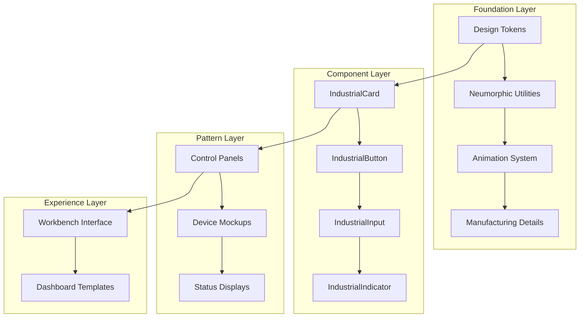

# Industrial Skeuomorphism Design System

## Overview

The Industrial Skeuomorphism Design System transforms a standard React/TypeScript + Tailwind CSS frontend into an immersive industrial interface that simulates real manufacturing equipment and control panels. The system leverages neumorphic design principles, physical interaction patterns, and authentic manufacturing details to create interfaces that feel like operating actual hardware.

The design system consists of four primary layers:
1. **Foundation Layer**: Enhanced CSS utilities and design tokens
2. **Component Layer**: React components with industrial styling and behavior
3. **Pattern Layer**: Composite components and layout patterns
4. **Experience Layer**: Complete interface templates and interaction flows

## Architecture

### System Architecture



### Component Hierarchy

The design system follows a hierarchical structure where each component builds upon foundation utilities:

- **Atomic Components**: Basic interactive elements (buttons, inputs, indicators)
- **Molecular Components**: Combined elements (control groups, status panels)
- **Organism Components**: Complete interface sections (device mockups, control panels)
- **Template Components**: Full page layouts and interface patterns

### Technology Integration

The system integrates with the existing React/TypeScript + Tailwind CSS stack by:
- Extending Tailwind configuration with custom utilities
- Creating React components with TypeScript interfaces
- Maintaining compatibility with existing component patterns
- Providing migration paths for current implementations

## Components and Interfaces

### Core Component Interfaces

```typescript
// Base industrial component props
interface IndustrialComponentProps {
  variant?: 'raised' | 'recessed' | 'flat';
  depth?: 'subtle' | 'normal' | 'deep';
  manufacturing?: {
    screws?: boolean;
    vents?: boolean;
    connectors?: boolean;
    texture?: 'smooth' | 'brushed' | 'textured';
  };
  className?: string;
  children?: React.ReactNode;
}

// Button component interface
interface IndustrialButtonProps extends IndustrialComponentProps {
  size?: 'sm' | 'md' | 'lg' | 'xl';
  type?: 'primary' | 'secondary' | 'danger' | 'success';
  pressed?: boolean;
  disabled?: boolean;
  onClick?: () => void;
  haptic?: boolean; // Enable press physics
}

// Card component interface
interface IndustrialCardProps extends IndustrialComponentProps {
  title?: string;
  subtitle?: string;
  status?: 'active' | 'inactive' | 'error' | 'warning';
  bolted?: boolean; // Show corner screws
  ventilated?: boolean; // Show vent slots
}

// Input component interface
interface IndustrialInputProps extends IndustrialComponentProps {
  type?: 'text' | 'number' | 'password' | 'email';
  placeholder?: string;
  value?: string;
  onChange?: (value: string) => void;
  status?: 'normal' | 'error' | 'success' | 'warning';
  ledIndicator?: boolean;
}

// LED Indicator interface
interface IndustrialIndicatorProps {
  status: 'off' | 'on' | 'error' | 'warning' | 'success';
  size?: 'sm' | 'md' | 'lg';
  glow?: boolean;
  pulse?: boolean;
  label?: string;
}
```

### Component Architecture Patterns

Each component follows a consistent internal structure:

1. **Base Container**: Applies neumorphic shadows and base styling
2. **Manufacturing Layer**: Adds screws, vents, and surface details
3. **Content Layer**: Houses the functional content
4. **Interaction Layer**: Handles animations and state changes
5. **Accessibility Layer**: Ensures proper ARIA attributes and keyboard navigation

## Data Models

### Design Token Structure

```typescript
interface IndustrialDesignTokens {
  colors: {
    surface: {
      primary: '#e0e5ec';
      secondary: '#d1d9e6';
      tertiary: '#c8d0e7';
    };
    shadows: {
      light: '#ffffff';
      dark: '#babecc';
      accent: '#ff4757';
    };
    text: {
      primary: '#2d3436';
      secondary: '#636e72';
      muted: '#b2bec3';
    };
    led: {
      off: '#74b9ff';
      on: '#00b894';
      error: '#e17055';
      warning: '#fdcb6e';
    };
  };
  
  shadows: {
    neumorphic: {
      raised: {
        subtle: '4px 4px 8px #babecc, -4px -4px 8px #ffffff';
        normal: '8px 8px 16px #babecc, -8px -8px 16px #ffffff';
        deep: '12px 12px 24px #babecc, -12px -12px 24px #ffffff';
      };
      recessed: {
        subtle: 'inset 4px 4px 8px #babecc, inset -4px -4px 8px #ffffff';
        normal: 'inset 8px 8px 16px #babecc, inset -8px -8px 8px #ffffff';
        deep: 'inset 12px 12px 24px #babecc, inset -12px -12px 24px #ffffff';
      };
    };
    glow: {
      led: '0 0 10px currentColor, 0 0 20px currentColor, 0 0 30px currentColor';
      accent: '0 0 15px #ff4757, 0 0 30px #ff4757';
    };
  };
  
  animations: {
    mechanical: {
      easing: 'cubic-bezier(0.34, 1.56, 0.64, 1)';
      duration: {
        fast: '150ms';
        normal: '250ms';
        slow: '400ms';
      };
    };
    press: {
      transform: 'translateY(2px)';
      shadowInvert: true;
      duration: '100ms';
    };
  };
  
  manufacturing: {
    screws: {
      size: '8px';
      color: '#95a5a6';
      shadow: '1px 1px 2px rgba(0,0,0,0.3)';
    };
    vents: {
      slotWidth: '2px';
      slotSpacing: '4px';
      color: 'rgba(0,0,0,0.1)';
    };
  };
}
```

### Component State Models

```typescript
// Button state management
interface ButtonState {
  isPressed: boolean;
  isHovered: boolean;
  isFocused: boolean;
  isDisabled: boolean;
}

// Card state management
interface CardState {
  status: 'active' | 'inactive' | 'error' | 'warning';
  isExpanded: boolean;
  hasContent: boolean;
}

// Input state management
interface InputState {
  value: string;
  isFocused: boolean;
  hasError: boolean;
  isValid: boolean;
  ledStatus: 'off' | 'on' | 'error' | 'success';
}
```

## Correctness Properties

*A property is a characteristic or behavior that should hold true across all valid executions of a system-essentially, a formal statement about what the system should do. Properties serve as the bridge between human-readable specifications and machine-verifiable correctness guarantees.*

Based on the prework analysis, I'll focus on the most critical properties that provide unique validation value while eliminating redundancy:

**Property 1: Neumorphic shadow consistency**
*For any* component using neumorphic styling, the rendered CSS should contain dual shadows with the exact pattern "8px 8px 16px #babecc, -8px -8px 16px #ffffff" for raised surfaces and inverted pattern with "inset" for recessed surfaces
**Validates: Requirements 1.1, 1.2**

**Property 2: Shadow depth pattern preservation**
*For any* shadow depth variant (subtle, normal, deep), the dual-shadow structure should be maintained with proportional scaling of the shadow distances while preserving the #babecc and #ffffff color scheme
**Validates: Requirements 1.3**

**Property 3: Manufacturing detail completeness**
*For any* component with manufacturing details enabled, the rendered DOM should contain the appropriate detail elements (screws for bolted components, vent slots for ventilated components, texture patterns for textured surfaces)
**Validates: Requirements 2.1, 2.2, 7.1, 7.3**

**Property 4: Button press physics**
*For any* button component, when a press event is triggered, the element should apply translateY(2px) transform and invert its shadow pattern, then return to original state on release with mechanical easing
**Validates: Requirements 3.2, 3.3, 3.5**

**Property 5: Input recessed styling**
*For any* input component, the default state should have inset shadows, and focus state should enhance the inset effect with deeper shadow values while maintaining readability contrast ratios above 4.5:1
**Validates: Requirements 4.1, 4.2, 4.3**

**Property 6: LED indicator color coding**
*For any* LED indicator component, the status-to-color mapping should follow industrial standards: error→red (#e17055), success→green (#00b894), warning→amber (#fdcb6e), with active states including glow effects via box-shadow
**Validates: Requirements 5.1, 5.2, 5.5**

**Property 7: Animation mechanical easing**
*For any* animation in the system, the CSS transition or animation should use the mechanical easing function "cubic-bezier(0.34, 1.56, 0.64, 1)" and complete smoothly without abrupt stops
**Validates: Requirements 8.1, 8.2, 8.5**

**Property 8: Component TypeScript interface compliance**
*For any* exported component, it should have proper TypeScript definitions matching the specified interfaces and accept all documented props for customization
**Validates: Requirements 9.2, 9.4**

**Property 9: Tailwind utility integration**
*For any* custom utility class, it should be available in the Tailwind class system and work seamlessly with existing Tailwind classes without CSS conflicts or specificity issues
**Validates: Requirements 10.1, 10.2, 10.5**

## Error Handling

### Component Error Boundaries

The design system implements comprehensive error handling to maintain industrial interface reliability:

**Graceful Degradation Strategy**:
- Components fall back to basic styling if neumorphic utilities fail to load
- Manufacturing details are optional and won't break component rendering if missing
- Animation failures default to instant state changes rather than broken transitions
- TypeScript errors are caught at build time with strict type checking

**Error Recovery Patterns**:
```typescript
// Component-level error boundary
interface IndustrialErrorBoundaryState {
  hasError: boolean;
  errorType: 'styling' | 'animation' | 'interaction' | 'unknown';
  fallbackMode: boolean;
}

// Fallback styling when neumorphic effects fail
const fallbackStyles = {
  card: 'bg-gray-100 border border-gray-300 rounded-lg',
  button: 'bg-gray-200 hover:bg-gray-300 active:bg-gray-400',
  input: 'bg-white border border-gray-300 focus:border-blue-500'
};
```

**Animation Error Handling**:
- CSS animation failures are detected via `animationend` events
- Missing easing functions fall back to `ease-in-out`
- Transform failures are caught and logged without breaking interaction
- Reduced motion preferences are respected via `prefers-reduced-motion`

### Accessibility Error Prevention

**Color Contrast Validation**:
- All text/background combinations are validated against WCAG AA standards
- LED indicators include text labels for color-blind users
- Focus indicators remain visible even when neumorphic effects fail

**Keyboard Navigation Fallbacks**:
- All interactive elements maintain proper tab order
- Custom components implement standard ARIA patterns
- Focus management works even without visual press effects

## Testing Strategy

### Dual Testing Approach

The Industrial Design System requires both unit testing and property-based testing to ensure comprehensive coverage:

**Unit Testing Focus**:
- Specific component rendering with various prop combinations
- Event handler functionality (click, focus, hover)
- CSS class application for different states
- TypeScript interface compliance
- Accessibility attribute presence

**Property-Based Testing Focus**:
- Universal shadow pattern consistency across all components
- Animation behavior verification across random component states
- Color coding compliance across all status indicators
- Manufacturing detail presence across component variations
- Cross-browser CSS compatibility testing

**Property-Based Testing Library**: The system will use **fast-check** for JavaScript/TypeScript property-based testing, configured to run a minimum of 100 iterations per property test.

**Property Test Tagging**: Each property-based test will include a comment with the format:
`**Feature: industrial-design-system, Property {number}: {property_text}**`

**Unit Test Coverage**:
- Component mounting and unmounting
- Prop validation and default values
- State management and updates
- Error boundary behavior
- Performance regression prevention

**Integration Testing**:
- Complete design system integration with existing React application
- Tailwind utility class generation and application
- Cross-component consistency verification
- Theme switching and customization
- Build process and bundle size optimization

### Testing Infrastructure

**Component Testing Setup**:
```typescript
// Test utilities for industrial components
interface IndustrialTestUtils {
  renderWithTheme: (component: ReactElement) => RenderResult;
  mockIndustrialProps: () => IndustrialComponentProps;
  assertNeumorphicShadows: (element: HTMLElement) => void;
  simulatePress: (button: HTMLElement) => Promise<void>;
  measureAnimationTiming: (element: HTMLElement) => AnimationMetrics;
}
```

**Visual Regression Testing**:
- Automated screenshot comparison for component visual consistency
- Cross-browser rendering verification
- Responsive design validation
- Dark/light theme compatibility testing

**Performance Testing**:
- Animation frame rate monitoring
- CSS bundle size optimization
- Component render time measurement
- Memory usage tracking for complex interactions

The testing strategy ensures that the Industrial Design System maintains both functional correctness and visual fidelity while providing a robust foundation for building industrial-themed interfaces.