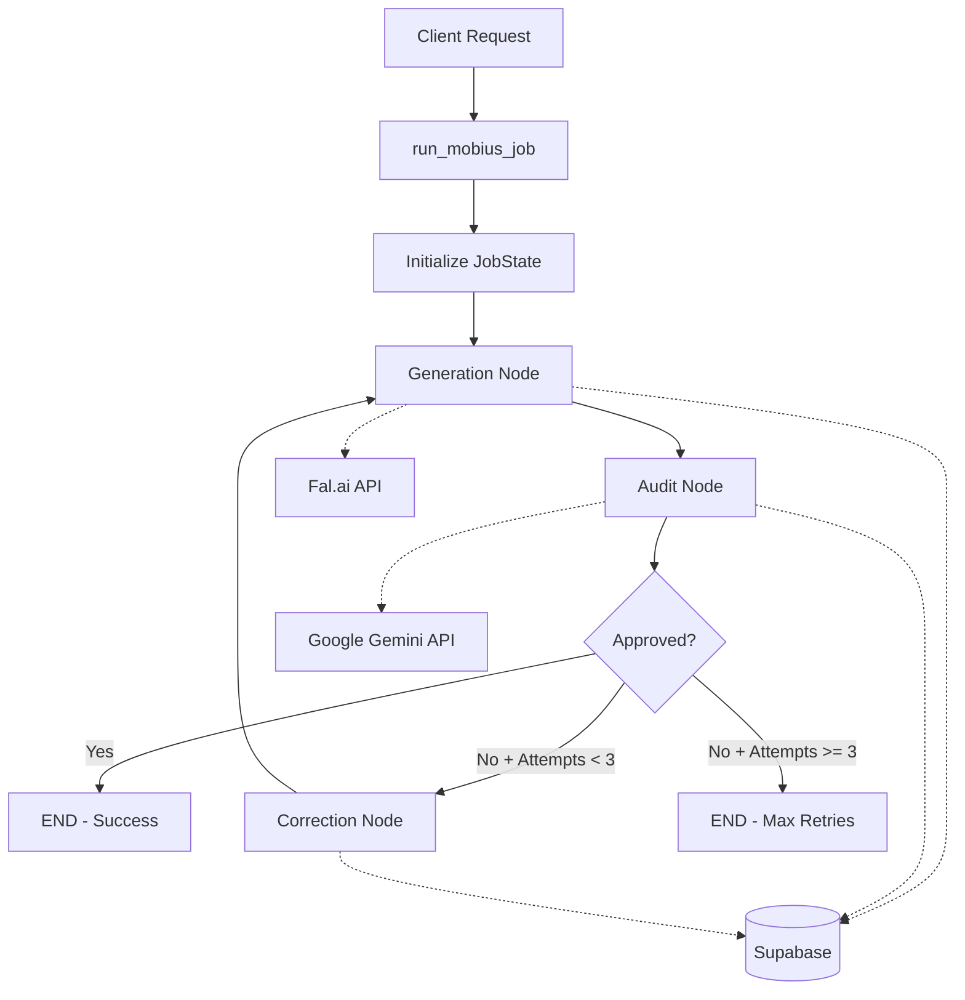

# Design Document: Mobius Brand Governance Engine

## Overview

Mobius is a serverless brand governance system that ensures AI-generated images comply with brand guidelines through an automated generation-audit-correction loop. The system orchestrates three external services (Fal.ai for generation, Google Gemini for auditing, and Supabase for persistence) using LangGraph as a state machine framework, all deployed on Modal's serverless infrastructure.

The core workflow follows a feedback loop pattern:
1. Generate an image based on a prompt enriched with brand colors
2. Audit the image against brand rules using visual AI
3. If non-compliant, correct the prompt and regenerate
4. Repeat until approval or max attempts reached

## Architecture

### High-Level Architecture



### Technology Stack

- **Infrastructure**: Modal (serverless Python runtime)
- **Orchestration**: LangGraph (state machine framework)
- **Image Generation**: Fal.ai (Flux.2 Pro model)
- **Visual Audit**: Google GenAI SDK (Gemini 1.5 Pro)
- **Persistence**: Supabase (PostgreSQL)

### Deployment Model

The system runs as a Modal App with serverless functions. Each workflow node is decorated with `@app.function()` to enable distributed execution. Secrets are managed through Modal's secret management system and injected at runtime.

## Components and Interfaces

### 0. HTTP API Contract

The system exposes a web endpoint for external clients (Next.js frontend) to trigger brand governance workflows.

#### Endpoint: `POST /run_mobius_job`

**Request Schema (Pydantic)**:
```python
from pydantic import BaseModel
from typing import List

class MobiusJobRequest(BaseModel):
    prompt: str
    brand_hex_codes: List[str]
    brand_rules: str
```

**Request Body Example**:
```json
{
  "prompt": "A modern tech startup logo with clean lines",
  "brand_hex_codes": ["#FF6B6B", "#4ECDC4", "#95E1D3"],
  "brand_rules": "Minimalist design, sans-serif fonts, geometric shapes only"
}
```

**Response (Success - 200 OK)**:
```json
{
  "status": "success",
  "final_state": {
    "prompt": "A modern tech startup logo with clean lines, use more geometric shapes",
    "brand_hex_codes": ["#FF6B6B", "#4ECDC4", "#95E1D3"],
    "brand_rules": "Minimalist design, sans-serif fonts, geometric shapes only",
    "current_image_url": "https://fal.media/files/...",
    "attempt_count": 2,
    "audit_history": [
      {
        "approved": false,
        "reason": "Design lacks geometric emphasis",
        "fix_suggestion": "use more geometric shapes"
      },
      {
        "approved": true,
        "reason": "Complies with all brand guidelines",
        "fix_suggestion": ""
      }
    ],
    "is_approved": true
  }
}
```

**Response (Failure - Max Retries - 200 OK)**:
```json
{
  "status": "failed",
  "reason": "max_retries_reached",
  "final_state": {
    "prompt": "...",
    "attempt_count": 3,
    "audit_history": [...],
    "is_approved": false
  }
}
```

**Response (Error - 500 Internal Server Error)**:
```json
{
  "status": "error",
  "message": "Internal workflow error: <details>"
}
```

**Implementation Note**: The `run_mobius_job` function will be decorated with `@app.web_endpoint(method="POST")` to expose it as an HTTP endpoint accessible from the Next.js frontend. Modal's web endpoints support Pydantic models for automatic request validation and serialization.

**Function Signature**:
```python
@app.web_endpoint(method="POST")
def run_mobius_job(request: MobiusJobRequest):
    prompt = request.prompt
    brand_hex_codes = request.brand_hex_codes
    brand_rules = request.brand_rules
    # ... workflow execution
```

**Benefits of Pydantic**:
- Automatic request validation with clear error messages
- Type safety and IDE autocomplete support
- Built-in serialization/deserialization
- Prevents 422 validation errors from malformed requests

### 1. JobState (State Schema)

The central data structure that flows through the workflow:

```python
class JobState(TypedDict):
    prompt: str                      # Current prompt (modified during corrections)
    brand_hex_codes: List[str]       # Required brand colors
    brand_rules: str                 # Brand compliance guidelines
    current_image_url: Optional[str] # Latest generated image
    attempt_count: int               # Number of generation attempts
    audit_history: List[dict]        # All audit results
    is_approved: bool                # Current approval status
```

### 2. Workflow Nodes

#### Generation Node (`generate_node`)
- **Input**: JobState
- **Output**: JobState with updated `current_image_url` and incremented `attempt_count`
- **External Dependency**: Fal.ai API
- **Behavior**:
  - Enriches prompt with brand hex codes
  - Calls Fal.ai Flux.2 Pro endpoint
  - Handles API errors gracefully (sets `current_image_url` to None)
  - Persists state with "GENERATED" status

#### Audit Node (`audit_node`)
- **Input**: JobState
- **Output**: JobState with updated `audit_history` and `is_approved`
- **External Dependency**: Google Gemini API
- **Behavior**:
  - Constructs compliance audit prompt with brand rules and colors
  - Sends image to Gemini for visual analysis
  - Parses JSON response into structured audit result
  - Handles API errors with fail-safe verdict
  - Persists state with "AUDITED" status

#### Correction Node (`correct_node`)
- **Input**: JobState
- **Output**: JobState with modified `prompt`
- **External Dependency**: None
- **Behavior**:
  - Extracts `fix_suggestion` from last audit result
  - Appends suggestion to current prompt
  - Persists state with "CORRECTED" status

### 3. Helper Functions

#### `persist_state(state: JobState, status: str)`
- **Purpose**: Persist workflow state to Supabase
- **Graceful Degradation**: Falls back to console logging if credentials missing
- **Error Handling**: Catches and logs Supabase exceptions without crashing

### 4. Orchestration Logic

#### `run_mobius_job(request_data: dict)`
- **Entry Point**: Main function that constructs and executes the workflow
- **Deployment**: Decorated with `@app.web_endpoint(method="POST")` to expose as HTTP endpoint
- **Input**: Single dictionary containing `prompt`, `brand_hex_codes`, and `brand_rules` keys
- **Output**: Dictionary with `status` and `final_state` (or `error` details)
- **Graph Construction**:
  - Defines three nodes: generate, audit, correct
  - Sets "generate" as entry point
  - Adds unconditional edge: generate → audit
  - Adds conditional routing from audit based on approval status
  - Adds loop edge: correct → generate
- **Error Handling**: Wraps workflow execution in try-except to return proper HTTP error responses

#### Routing Logic (`route_decision`)
- **Max Attempts Check**: If `attempt_count >= 3` and not approved → END (failure)
- **Approval Check**: If `is_approved == True` → END (success)
- **Default**: Route to "correct" node for another iteration

## Data Models

### Audit Result Schema

```json
{
  "approved": boolean,
  "reason": "string explanation of compliance decision",
  "fix_suggestion": "specific prompt modification to address issues"
}
```

This schema is enforced through:
1. Gemini's `response_mime_type: "application/json"` configuration
2. Explicit schema definition in the audit prompt
3. JSON parsing with error handling

### Supabase Schema (Assumed)

```sql
-- job_logs table
CREATE TABLE job_logs (
  id SERIAL PRIMARY KEY,
  status VARCHAR(50),
  prompt TEXT,
  image_url TEXT,
  attempt INTEGER,
  approved BOOLEAN,
  created_at TIMESTAMP DEFAULT NOW()
);
```

## Data Models

### State Transitions

```
INITIAL → GENERATED → AUDITED → [COMPLETE | CORRECTED]
                                      ↓
                                  GENERATED (loop)
                                      ↓
                                  FAILED_MAX_RETRIES
```

## Error Handling

### 1. External API Failures

**Fal.ai Generation Errors**:
- Caught in try-except block
- Sets `current_image_url` to None
- Logs error to console
- Workflow continues (audit will handle None gracefully)

**Gemini Audit Errors**:
- Caught in try-except block
- Returns fail-safe audit result: `{approved: False, reason: "Audit Error", fix_suggestion: "Retry generation"}`
- Ensures workflow can continue

### 2. Persistence Failures

**Supabase Connection Issues**:
- Graceful degradation: logs to console instead
- Does not block workflow execution
- Allows MVP operation without database

### 3. Infinite Loop Prevention

**Max Attempts Limit**:
- Hard limit of 3 generation attempts
- Enforced in `route_decision` function
- Terminates with "FAILED_MAX_RETRIES" status
- Returns final state with audit history for debugging

### 4. Missing Secrets

**Modal Secrets Not Configured**:
- Supabase: Gracefully degrades to console logging
- Fal.ai/Gemini: Will raise exception (expected behavior - these are critical)

## Testing Strategy


### Testing Approach

The system will use a dual testing strategy combining unit tests for specific scenarios and property-based tests for universal correctness guarantees.

**Unit Tests** will cover:
- Specific example workflows (successful approval, max retries)
- Edge cases (missing credentials, API failures)
- Integration points between nodes

**Property-Based Tests** will verify:
- Universal properties that hold across all valid inputs
- State transitions and routing logic
- Data structure invariants

**Property-Based Testing Library**: We will use **Hypothesis** for Python, which provides robust property-based testing with automatic test case generation and shrinking.

**Test Configuration**: Each property-based test will run a minimum of 100 iterations to ensure thorough coverage of the input space.

## Correctness Properties

*A property is a characteristic or behavior that should hold true across all valid executions of a system—essentially, a formal statement about what the system should do. Properties serve as the bridge between human-readable specifications and machine-verifiable correctness guarantees.*

### Property 1: Generation produces image URL

*For any* JobState with a valid prompt and brand_hex_codes, when the generation node executes successfully, the resulting state should contain a non-None current_image_url.

**Validates: Requirements 1.2**

### Property 2: Audit result schema compliance

*For any* audit result in the audit_history, it must contain exactly three keys: "approved" (boolean), "reason" (string), and "fix_suggestion" (string).

**Validates: Requirements 2.1**

### Property 3: Audit appends to history

*For any* JobState with an image URL, when the audit node executes, the resulting state should have audit_history length increased by exactly one.

**Validates: Requirements 1.3**

### Property 4: Correction appends fix suggestion

*For any* JobState with at least one audit result containing a fix_suggestion, when the correction node executes, the resulting prompt should contain both the original prompt text and the fix_suggestion text.

**Validates: Requirements 2.2**

### Property 5: Non-approved states route to correction

*For any* JobState where is_approved is False and attempt_count is less than 3, the route_decision function should return "correct" (not END).

**Validates: Requirements 1.4**

### Property 6: Approved states complete workflow

*For any* JobState where is_approved is True, the route_decision function should return END regardless of attempt_count.

**Validates: Requirements 1.5**

### Property 7: Max attempts enforces termination

*For any* JobState where attempt_count is greater than or equal to 3 and is_approved is False, the route_decision function should return END.

**Validates: Requirements 6.1, 6.2**

### Property 8: Attempt count monotonically increases

*For any* JobState, after executing the generation node, the attempt_count in the resulting state should be exactly one greater than the input state's attempt_count.

**Validates: Requirements 1.2** (implicit - ensures generation tracking)

### Property 9: Graceful degradation without credentials

*For any* JobState and status string, calling persist_state with missing SUPABASE_URL or SUPABASE_KEY environment variables should not raise an exception.

**Validates: Requirements 4.4**

## Implementation Notes

### Secret Management

All secrets are managed through Modal's secret management system. The implementation expects a secret named "mobius-secrets" containing:
- `GEMINI_API_KEY`: Google Gemini API key (REQUIRED - used for both image generation and auditing)
- `SUPABASE_URL`: Supabase project URL (use pooler URL for production)
- `SUPABASE_KEY`: Supabase API key

**Note**: `FAL_KEY` is no longer required as Fal.ai has been replaced with Gemini 3 native image generation.

### Prompt Engineering

The generation node enriches the user prompt with brand colors:
```python
enhanced_prompt = f"{prompt}. Mandatory Brand Colors: {hex_string}"
```

This ensures Flux.2 receives explicit color guidance in every generation attempt.

The audit prompt is structured to enforce strict compliance checking:
- Includes brand rules as context
- Lists required colors explicitly
- Requests structured JSON response
- Emphasizes strict compliance evaluation

### State Immutability Considerations

While Python's TypedDict doesn't enforce immutability, the workflow nodes follow a functional pattern:
- Nodes receive state as input
- Nodes return modified state as output
- LangGraph manages state transitions

In production, consider using immutable data structures (e.g., `dataclasses` with `frozen=True`) to prevent accidental mutations.

### Scalability Considerations

**Current Design (MVP)**:
- Single workflow execution per job
- Synchronous node execution
- No job queue management

**Future Enhancements**:
- Batch processing of multiple jobs
- Parallel generation attempts with voting
- Job queue with priority management
- Webhook notifications for completion
- Caching of audit results for similar prompts

### Monitoring and Observability

**Current Logging**:
- Console output for each node execution
- Status emojis for visual parsing
- Error messages for API failures

**Recommended Additions**:
- Structured logging (JSON format)
- Metrics collection (attempt counts, approval rates)
- Distributed tracing (OpenTelemetry)
- Alert thresholds (high failure rates)

## Deployment

### Prerequisites

1. Modal account with CLI configured
2. Modal secret "mobius-secrets" created with all required keys
3. Supabase project with `job_logs` table created

### Deployment Commands

```bash
# Deploy to Modal
modal deploy orchestrator.py

# Get the web endpoint URL
modal app show mobius-worker

# Test deployment via HTTP
curl -X POST https://your-modal-app.modal.run/run_mobius_job \
  -H "Content-Type: application/json" \
  -d '{
    "prompt": "A modern tech startup logo",
    "brand_hex_codes": ["#FF6B6B", "#4ECDC4"],
    "brand_rules": "Minimalist design, sans-serif fonts, geometric shapes"
  }'
```

### Environment Setup

```bash
# Create Modal secret
modal secret create mobius-secrets \
  GEMINI_API_KEY=<your-gemini-key> \
  SUPABASE_URL=<your-supabase-pooler-url> \
  SUPABASE_KEY=<your-supabase-key>
```

**Getting Your Gemini API Key**:
1. Visit [Google AI Studio](https://ai.google.dev)
2. Sign in with your Google account
3. Click "Get API Key" in the top right
4. Create a new API key or use an existing one
5. Copy the key and use it in the command above

**Important**: Use the Supabase pooler URL (port 6543) for production deployments to avoid connection exhaustion.

## Future Enhancements

1. **Multi-Model Support**: Allow selection of different generation models beyond Flux.2
2. **Custom Audit Rules**: Support user-defined audit criteria beyond brand colors
3. **A/B Testing**: Generate multiple variants and select best match
4. **Human-in-the-Loop**: Optional manual review step before final approval
5. **Asset Versioning**: Track all generated variants with metadata
6. **Cost Optimization**: Cache similar prompts, implement smart retry logic
7. **Real-time Streaming**: WebSocket updates for long-running jobs
