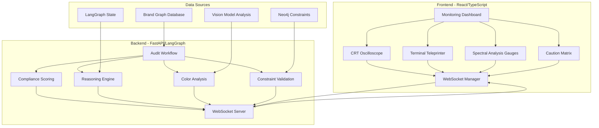

# Real-Time Brand Compliance Monitoring Design

## Overview

The Real-Time Brand Compliance Monitoring system transforms brand audit processes into an immersive industrial control room experience. The system provides live feedback on brand compliance through four primary monitoring components: CRT oscilloscope displays, terminal teleprinter logs, spectral analysis gauges, and caution matrix indicators. This creates an engaging monitoring experience that feels like operating mission control equipment while providing actionable insights into brand compliance status.

The system leverages WebSocket connections for real-time data streaming, SVG-based animations for smooth visual feedback, and industrial design aesthetics to create an authentic control room atmosphere. The interface serves as a comprehensive dashboard for brand auditors, compliance officers, and brand managers to monitor ongoing audit processes with immediate visual feedback.

## Architecture

### System Architecture



### Component Architecture

The monitoring system follows a modular architecture with four primary display components:

**CRT Oscilloscope (Right Sidebar)**
- SVG-based radar chart displaying compliance scores across dimensions
- Animated sweep line with phosphor green aesthetics
- Real-time polygon updates based on compliance data
- CRT scanline overlay and curved screen effects

**Terminal Teleprinter (Right Sidebar)**
- Monospace text display with typewriter animation
- Auto-scrolling log entries with fade-out effects
- Phosphor green text with CRT glow effects
- Audio/visual feedback for new log arrivals

**Spectral Analysis Gauges (Left Sidebar)**
- SVG liquid gauge columns for color usage percentages
- Animated liquid levels with gradient fills and bubble effects
- Brand-specific color representation
- Realistic fluid motion and surface tension effects

**Caution Matrix (Left Sidebar)**
- Grid of backlit tiles representing constraint categories
- LED-style glow effects with industrial color coding
- Smooth state transitions for violation status
- Hover states for detailed constraint information

### Technology Stack Integration

The system integrates with the existing technology stack:

- **Frontend**: React/TypeScript with existing industrial design system components
- **Real-time Communication**: WebSocket connections for live data streaming
- **Animation**: SVG-based animations with CSS transitions and transforms
- **Styling**: Industrial design tokens with CRT phosphor green color scheme
- **Backend Integration**: FastAPI WebSocket endpoints with LangGraph workflow integration
- **Data Sources**: Neo4j brand graph, Supabase storage, and Gemini vision model analysis

## Components and Interfaces

### Core Component Interfaces

```typescript
// Base monitoring component props
interface MonitoringComponentProps {
  className?: string;
  style?: React.CSSProperties;
  onError?: (error: Error) => void;
}

// CRT Oscilloscope component
interface CRTOscilloscopeProps extends MonitoringComponentProps {
  complianceScores: ComplianceScores;
  sweepSpeed?: number;
  phosphorIntensity?: number;
  scanlineOpacity?: number;
}

interface ComplianceScores {
  typography: number;    // 0-1 compliance score
  voice: number;        // 0-1 compliance score
  color: number;        // 0-1 compliance score
  logo: number;         // 0-1 compliance score
}

// Terminal Teleprinter component
interface TerminalTeleprinterProps extends MonitoringComponentProps {
  logs: ReasoningLog[];
  maxLines?: number;
  typewriterSpeed?: number;
  autoScroll?: boolean;
  audioFeedback?: boolean;
}

interface ReasoningLog {
  id: string;
  timestamp: Date;
  step: string;
  message: string;
  level: 'info' | 'warning' | 'error' | 'success';
}

// Spectral Analysis Gauges component
interface SpectralAnalysisGaugesProps extends MonitoringComponentProps {
  colorData: ColorAnalysisData[];
  animationSpeed?: number;
  bubbleIntensity?: number;
}

interface ColorAnalysisData {
  color: string;        // Hex color code
  name: string;         // Color name
  percentage: number;   // 0-100 usage percentage
  usage: 'primary' | 'secondary' | 'accent' | 'neutral';
}

// Caution Matrix component
interface CautionMatrixProps extends MonitoringComponentProps {
  constraints: ConstraintStatus[];
  gridColumns?: number;
  glowIntensity?: number;
}

interface ConstraintStatus {
  id: string;
  category: string;
  label: string;
  status: 'satisfied' | 'warning' | 'violation' | 'critical';
  description?: string;
  lastUpdated: Date;
}

// WebSocket integration
interface WebSocketManager {
  connect(jobId: string): Promise<void>;
  disconnect(): void;
  onComplianceUpdate: (callback: (scores: ComplianceScores) => void) => void;
  onReasoningLog: (callback: (log: ReasoningLog) => void) => void;
  onColorAnalysis: (callback: (data: ColorAnalysisData[]) => void) => void;
  onConstraintUpdate: (callback: (constraints: ConstraintStatus[]) => void) => void;
  onStatusChange: (callback: (status: AuditStatus) => void) => void;
}

interface AuditStatus {
  jobId: string;
  status: 'pending' | 'processing' | 'generating' | 'auditing' | 'correcting' | 'completed' | 'failed';
  progress: number;
  currentStep: string;
}
```

### Animation and Visual Effects Interfaces

```typescript
// SVG animation utilities
interface SVGAnimationConfig {
  duration: number;
  easing: string;
  delay?: number;
  loop?: boolean;
}

interface RadarSweepConfig extends SVGAnimationConfig {
  sweepAngle: number;
  phosphorTrail: boolean;
  scanlineCount: number;
}

interface LiquidGaugeConfig extends SVGAnimationConfig {
  waveAmplitude: number;
  waveFrequency: number;
  bubbleCount: number;
  surfaceTension: number;
}

interface LEDGlowConfig extends SVGAnimationConfig {
  glowRadius: number;
  pulseIntensity: number;
  colorTransition: boolean;
}

// CRT visual effects
interface CRTEffectsConfig {
  phosphorColor: string;
  scanlineOpacity: number;
  curvature: number;
  glowIntensity: number;
  noiseLevel: number;
}
```

## Data Models

### Real-Time Data Structures

```typescript
// WebSocket message types
interface WebSocketMessage {
  type: 'compliance_score' | 'reasoning_log' | 'color_analysis' | 'constraint_update' | 'status_change';
  jobId: string;
  timestamp: Date;
  payload: unknown;
}

interface ComplianceScoreMessage extends WebSocketMessage {
  type: 'compliance_score';
  payload: ComplianceScores;
}

interface ReasoningLogMessage extends WebSocketMessage {
  type: 'reasoning_log';
  payload: ReasoningLog;
}

interface ColorAnalysisMessage extends WebSocketMessage {
  type: 'color_analysis';
  payload: ColorAnalysisData[];
}

interface ConstraintUpdateMessage extends WebSocketMessage {
  type: 'constraint_update';
  payload: ConstraintStatus[];
}

interface StatusChangeMessage extends WebSocketMessage {
  type: 'status_change';
  payload: AuditStatus;
}

// Component state management
interface MonitoringState {
  isConnected: boolean;
  currentJob: string | null;
  complianceScores: ComplianceScores;
  reasoningLogs: ReasoningLog[];
  colorAnalysis: ColorAnalysisData[];
  constraints: ConstraintStatus[];
  auditStatus: AuditStatus;
  lastUpdate: Date;
}

// Animation state tracking
interface AnimationState {
  radarSweepAngle: number;
  liquidLevels: Record<string, number>;
  glowStates: Record<string, boolean>;
  typewriterPosition: number;
  isAnimating: boolean;
}
```

### Backend Integration Models

```typescript
// LangGraph workflow integration
interface WorkflowState {
  jobId: string;
  brandId: string;
  currentStep: string;
  stepProgress: number;
  totalSteps: number;
  reasoning: string[];
  complianceResults: ComplianceResults;
  colorAnalysis: ColorAnalysisResults;
  constraintViolations: ConstraintViolation[];
}

interface ComplianceResults {
  overall_score: number;
  category_scores: {
    typography: number;
    voice: number;
    color: number;
    logo: number;
  };
  violations: Violation[];
  recommendations: string[];
}

interface ColorAnalysisResults {
  dominant_colors: Array<{
    hex: string;
    name: string;
    percentage: number;
    brand_match: boolean;
  }>;
  color_harmony: number;
  brand_consistency: number;
}

interface ConstraintViolation {
  constraint_id: string;
  category: string;
  severity: 'low' | 'medium' | 'high' | 'critical';
  description: string;
  recommendation: string;
}
```

## Correctness Properties

*A property is a characteristic or behavior that should hold true across all valid executions of a system-essentially, a formal statement about what the system should do. Properties serve as the bridge between human-readable specifications and machine-verifiable correctness guarantees.*

After completing the prework analysis and performing property reflection to eliminate redundancy, the following properties provide unique validation value:

**Property 1: Compliance score radar polygon accuracy**
*For any* set of compliance scores (typography, voice, color, logo), the radar polygon coordinates should accurately reflect the score values with proper scaling and positioning within the SVG viewport
**Validates: Requirements 1.2, 1.4**

**Property 2: WebSocket data flow consistency**
*For any* WebSocket message received, the corresponding UI component should update immediately with the correct data format and trigger appropriate animations
**Validates: Requirements 5.2, 5.3, 5.4, 5.5**

**Property 3: Terminal typewriter animation sequencing**
*For any* new reasoning log entry, the typewriter animation should display characters sequentially at the configured speed and auto-scroll to show the latest entry
**Validates: Requirements 2.2, 2.4**

**Property 4: Liquid gauge level animation accuracy**
*For any* color percentage value, the liquid gauge should animate to the correct fill level with smooth transitions and maintain visual consistency with the brand color
**Validates: Requirements 3.2, 3.5**

**Property 5: Constraint matrix LED state mapping**
*For any* constraint status change, the corresponding matrix tile should display the correct LED color according to industrial standards (green=satisfied, yellow=warning, red=violation, red-blinking=critical)
**Validates: Requirements 4.2, 4.3, 4.4**

**Property 6: Industrial aesthetic consistency**
*For any* monitoring component, the rendered output should use the phosphor green color scheme, monospace fonts for text, and CRT-style visual effects consistently
**Validates: Requirements 8.1, 8.3, 6.5**

**Property 7: Component synchronization coordination**
*For any* audit status change, all monitoring components (oscilloscope, teleprinter, gauges, matrix) should update simultaneously without visual conflicts or timing issues
**Validates: Requirements 6.1, 6.4**

**Property 8: Accessibility compliance across components**
*For any* visual information displayed, the component should include proper ARIA labels, alternative text descriptions, and support for reduced motion preferences
**Validates: Requirements 10.1, 10.2, 10.3, 10.4, 10.5**

**Property 9: Component interface standardization**
*For any* monitoring component, it should accept standardized data interfaces and maintain independence from other components while supporting coordinated updates
**Validates: Requirements 7.2, 7.4**

## Error Handling

### WebSocket Connection Management

The monitoring system implements robust error handling for real-time connectivity:

**Connection Resilience**:
- Automatic reconnection with exponential backoff for WebSocket failures
- Graceful degradation to polling mode if WebSocket is unavailable
- Connection state indicators in the monitoring interface
- Buffering of missed updates during disconnection periods

**Data Validation**:
```typescript
interface DataValidator {
  validateComplianceScores(scores: unknown): ComplianceScores | null;
  validateReasoningLog(log: unknown): ReasoningLog | null;
  validateColorAnalysis(data: unknown): ColorAnalysisData[] | null;
  validateConstraintStatus(status: unknown): ConstraintStatus[] | null;
}

// Error recovery patterns
interface ErrorRecovery {
  onConnectionLost: () => void;
  onDataCorruption: (component: string) => void;
  onAnimationFailure: (animation: string) => void;
  onPerformanceDegradation: () => void;
}
```

**Animation Error Handling**:
- SVG animation failures fall back to instant state updates
- Performance monitoring prevents animation overload
- Reduced motion support for accessibility compliance
- Memory leak prevention for long-running animations

### Component Error Boundaries

Each monitoring component implements error boundaries to prevent cascade failures:

**Isolation Strategy**:
- Individual component failures don't affect other monitoring displays
- Error states display meaningful fallback content
- Automatic recovery attempts with user notification
- Logging of component errors for debugging

**Fallback Behaviors**:
```typescript
interface ComponentFallbacks {
  oscilloscope: {
    staticRadar: boolean;
    basicScoreDisplay: boolean;
    errorMessage: string;
  };
  teleprinter: {
    basicLogDisplay: boolean;
    noAnimation: boolean;
    scrollToBottom: boolean;
  };
  gauges: {
    staticBars: boolean;
    percentageText: boolean;
    colorFallback: string;
  };
  matrix: {
    basicGrid: boolean;
    textLabels: boolean;
    statusIcons: boolean;
  };
}
```

## Testing Strategy

### Dual Testing Approach

The Real-Time Brand Compliance Monitoring system requires both unit testing and property-based testing to ensure comprehensive coverage of real-time behavior and visual consistency:

**Unit Testing Focus**:
- Component rendering with various prop combinations
- WebSocket connection establishment and message handling
- Animation trigger conditions and state transitions
- Error boundary behavior and fallback rendering
- Accessibility attribute presence and keyboard navigation

**Property-Based Testing Focus**:
- Universal data flow consistency across all WebSocket messages
- Animation accuracy across random compliance score ranges
- Visual consistency across different component states
- Cross-component synchronization across various update patterns
- Accessibility compliance across all component variations

**Property-Based Testing Library**: The system will use **fast-check** for JavaScript/TypeScript property-based testing, configured to run a minimum of 100 iterations per property test.

**Property Test Tagging**: Each property-based test will include a comment with the format:
`**Feature: realtime-brand-compliance-monitoring, Property {number}: {property_text}**`

### Real-Time Testing Challenges

**WebSocket Testing Strategy**:
```typescript
// Mock WebSocket for testing
interface MockWebSocketServer {
  simulateConnection(): void;
  sendMessage(message: WebSocketMessage): void;
  simulateDisconnection(): void;
  simulateReconnection(): void;
  getReceivedMessages(): WebSocketMessage[];
}

// Animation testing utilities
interface AnimationTestUtils {
  captureAnimationFrames(component: ReactElement): AnimationFrame[];
  measureAnimationTiming(element: HTMLElement): TimingMetrics;
  verifyAnimationSmoothness(frames: AnimationFrame[]): boolean;
  checkPerformanceMetrics(component: ReactElement): PerformanceMetrics;
}
```

**Visual Regression Testing**:
- Automated screenshot comparison for CRT visual effects
- SVG animation frame capture and comparison
- Cross-browser rendering consistency verification
- Performance benchmarking for 60fps animation requirements

**Integration Testing**:
- End-to-end WebSocket communication with mock backend
- Component synchronization verification across update scenarios
- Error recovery testing with simulated connection failures
- Accessibility testing with screen reader simulation

### Performance Testing

**Real-Time Performance Requirements**:
- 60fps animation performance monitoring
- WebSocket message processing latency measurement
- Memory usage tracking for long-running sessions
- CPU usage optimization for SVG animations

**Load Testing Scenarios**:
```typescript
interface LoadTestScenarios {
  highFrequencyUpdates: {
    messagesPerSecond: number;
    duration: number;
    expectedPerformance: PerformanceThresholds;
  };
  multipleSimultaneousJobs: {
    concurrentJobs: number;
    updateFrequency: number;
    memoryLimits: MemoryThresholds;
  };
  extendedSession: {
    sessionDuration: number;
    updatePattern: UpdatePattern;
    degradationLimits: DegradationThresholds;
  };
}
```

The testing strategy ensures that the Real-Time Brand Compliance Monitoring system maintains both functional correctness and performance requirements while providing an engaging and reliable monitoring experience for brand compliance auditing.